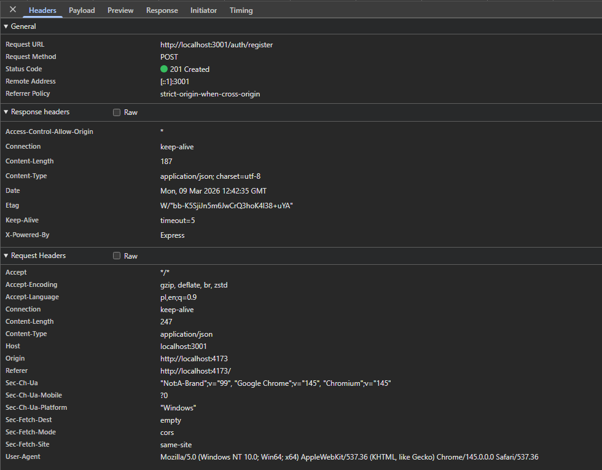
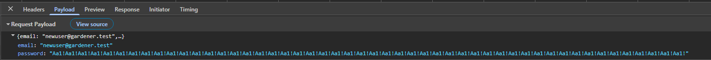

# Bug Report – BUG-001 – Missing maximum length validation on email and password fields

## Summary

Registration and login forms accept email and password inputs of unlimited length, allowing accounts to be created with excessively long credentials without any validation error.

---

## Environment

| Field | Value |
|---|---|
| Frontend URL | http://localhost:4173 |
| Backend | http://localhost:3001 |
| Database | MongoDB Cloud |
| Browser | Chromium |
| OS | Windows 10 |
| Date found | 2026-03-07 |

---

## Severity

- [ ] Critical
- [ ] Major
- [x] Minor

---

## Status

- [x] New
- [ ] In progress
- [ ] Fixed
- [ ] Closed

---

## Related Test Case

TC ID: `AUTH-07`

---

## Steps to Reproduce

1. Navigate to `/register`
2. Enter a 200-character string in the email field (e.g. `Aa1!` repeated 50 times)
3. Enter a 200-character string in the password field (e.g. `Aa1!` repeated 50 times)
4. Click the "Register" button

---

## Expected Result

Validation error displayed for both fields indicating maximum allowed length. Account should not be created.

---

## Actual Result

No validation error is displayed. Account is created successfully with a 200-character email and/or 200-character password. The same lack of validation is present on the `/login` form.

---

## Evidence

